Overview
========
Cloud Build의 Logs 결과를 Console에서 확인하기에 번잡한점이 있습니다.  
관련해서 Slack으로 Notifiaciton을 하여 Build가 어떤형태로 진행되고 있는지, 확인하고자 가이드를 만들었습니다.
* * *
1.  Required Permissions and API Enforcement
    1.  Enable APIs
        
        1.  Cloud Run, Cloud Build, Secret Manager API  
            
        2.  Cloud Storage, Artifact Registry, Source Repository API
            
    2.  Service Account Permissions
        
        1.  Artifact Registry Writer
            
        2.  Source Repository Writer
            
        3.  Cloud Build Editor, Cloud Build WorkerPool User
            
        4.  Cloud Run Invoker
        5.  IAP Secured Tunnel User
            
        6.  Service Account User, Token Creator
            
        7.  Secret Manager Secret Accessor
            
        8.  Storage Admin 
        
Slack Notification 구성을 위한 GCP Service에 대해서는 아래 Reference Link를 첨부할 예정이며 작업 전에 참고하시면 좋을것 같습니다. 
* * *
### Architecture  
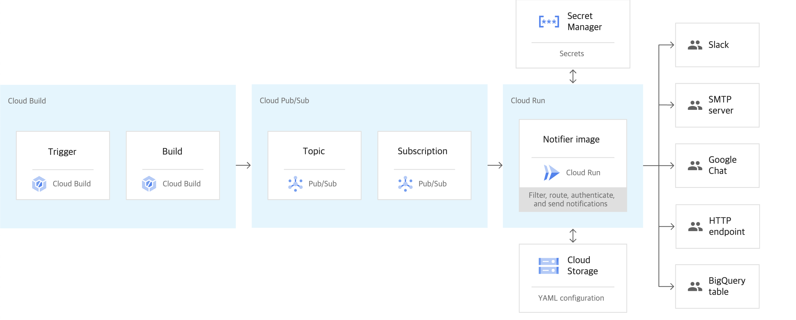

* * * 

### Configuration

Cloud Build에 Notification을 전달하기 위해 우선 Slack의 App구성이 필요하며, 첨부 [링크](https://api.slack.com/apps)에서 App 생성을 진행해주시면 됩니다.  
Cloud Build ICON은 [GCP Icon Library](https://cloud.google.com/icons?hl=ja)를 참고 부탁드립니다. 

1.  ### Webhook URL Configuration
    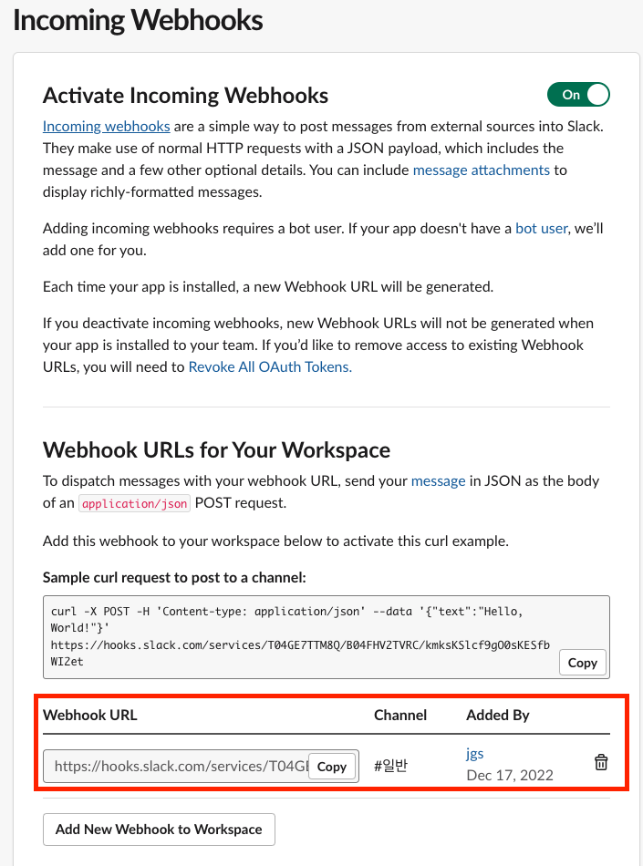

    1.  만든 Slack 앱의 Incoming Webhooks에 액세스합니다.
    2.  \[Add New Webhook to Workspace\] 버튼을 클릭합니다.
    3.  통지할 채널을 선택합니다.
    4.  \[허용\] 버튼을 클릭합니다.
    5.  Webhook URL이 생성됩니다.
        
2.  ### Secret Manager Configuration 

    1.  \[ Console \] > \[ Security \] > \[ Secret Manager \] > \[ Create SECRET \]  
        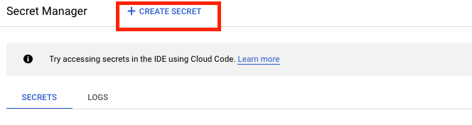
    2.  \[ Secret Value \] 
        1.  사전에 생성한 Webhook URL을 기입합니다.  
        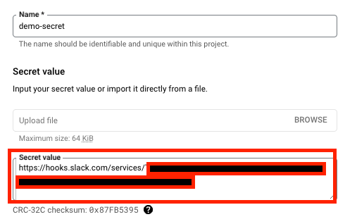    
        2.  Result  
        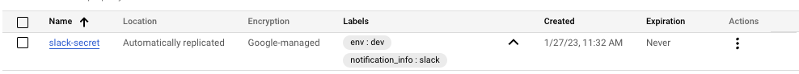                
3.  ### Pub/Sub Configuration
    
    1.  Pub/Sub의 경우, cloud-builds의 Subscription을 받기위함으로 아래의 절차를 따릅니다.        
    2.  사전 준비 사항
        1.  [Cloud Build API](https://console.cloud.google.com/apis/library/cloudbuild.googleapis.com?hl=ko), [Pub/Sub API](https://console.cloud.google.com/apis/library/pubsub.googleapis.com?hl=ko) Enable  
    3.  Cloud Builds Topics 주제 생성
        ```
        ##Pub/Sub Topic Create
        gcloud pubsub topics create cloud-builds --project=$PROJECT_ID
 
        ##Pub/Sub Subscriber Create
        gcloud pubsub subscriptions create $SUBSCRIBER_NAME \
        --topic=projects/$PROJECT_ID/topics/$TOPICS_NAME \
        --topic-project=$PROJECT_ID \
        --push-auth-service-account=$PUSH_SERVICE_ACCOUNT_EMAIL \
        --push-endpoint=$CLOUD_RUN_HTTPS_URL \
        --labels=$KEY1=$VALUE1,$KEY2=$VALUE2 \
        --impersonate-service-account=$PUSH_SERVICE_ACCOUNT_EMAIL
        ```
4.  ### Cloud Run Configuration
    
    1.  Cloud Run의 경우, 위 Architecture를 기준으로 GCS와 Secret 값을 통해 배포하도록 설계되어 있습니다. 
    2.  사전 준비 사항
        1.  GCS(Google Cloud Storage)
        2.  Secret Manager(Webhook Secret)
    3.  Cloud Run 배포에 사용될 GCS를 생성해줍니다.
        ```
        ## How to create IAM User GCS
        gsutil mb -b on -c standard -l asia-northeast3  gs://BUCKET_NAME
        
        ## How to create IAM User with impersonate SA for GCS
        gsutil -i $SERIVCE_ACCOUNT_EMAIL mb -b on -c $Storage_Class -l $LOCATION gs://$BUCKET_NAME
        ```
    4.  생성된 GCS에 아래 두개의 파일을 gsutil 혹은 Console에 Upload 해줍니다.
        1.  [notification.yaml](./cloudbuild-notification/notification.yaml)

            1.  yaml template으로 slack.json을 사용하는데, template type은 go lang으로 구성되어있습니다. 
            2.  Secret에는 GCP에서 생성한 Secret 정보를 기입해줍니다. 
            3.  Notification의 Filter는 GCP에서 제공하는 [Cloud Build REST API](https://cloud.google.com/build/docs/api/reference/rest/v1/projects.builds)를 기준으로 변경할 수 있으니 참고 바랍니다. 

        2.  [slack.json](./cloudbuild-notification/slack.json)

        3.  Local File Copy with GCS
            1.  On-Prem Terminal에서 gsutil 사용시 아래와 같은 이슈를 직면할수도 있으며, 해결 방안은 아래 내용 참고 부탁드립니다.     
                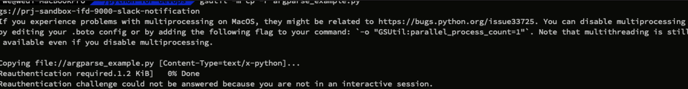                       
                1.  해결 방안
                    1.  parallel\_process\_count를 아래와 같이 기입해줍니다.
                        ```
                        ### Find Boto Configuration
                        $gsutil version -l
                        config path(s): /Users/we/.config/gcloud/legacy_credentials/jgs/.boto
                        ```
                    2.  vim을 활용하여 .boto를 아래와 같이 수정 및 저장해줍니다.
                        ```
                        ### OAuth, Credentials는 그대로 두고, [GSUtil] 추가
                        [GSUtil]
                        parallel_process_count = 1
                        ```
                    3.  저장 이후 아래와 같이 이슈 없이 gsutil copy가 정상적으로 되는것을 확인할 수 있습니다.  
                        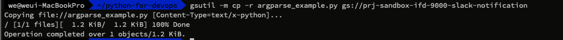                       
        4.  Cloud Run Deploy
            1.  GCS와 Secret을 위 가이드와 같이 준비가 완료되었다면, Cloud Run 배포를 진행할 수 있습니다. 
            2.  Cloud Run 배포 이전에 Artifact Registry에 slack Image를 배포하여 사용해도 되고, [GCP에서 제공하는 Image](https://console.cloud.google.com/artifacts/docker/gcb-release/us-east1/cloud-build-notifiers?project=gcb-release&hl=ko&_ga=2.123044744.284451751.1674983282-2031543155.1672134109&_gac=1.119059707.1674120443.Cj0KCQiA8aOeBhCWARIsANRFrQHptBqfqmtMd0je4-8guiJVJ_79h2MvdXkJID8tjCw3gB01-8zw48waApe6EALw_wcB)를 사용해도 무방합니다.   
                (\*현재 가이드에는 Artifact Registry를 사용하여 Cloud Run 배포를 진행하였습니다. )
                
            3.  Cloud Run 배포는 gcloud CLI혹은 Console에서 진행가능하며, 편의상 gcloud CLI로 아래와 같이 진행하였습니다.
                ```
                ### Cloud Run Deploy 
                gcloud run deploy $RUN_SERVICE_NAME \
                --image=asia-docker.pkg.dev/$PROJECT_ID/asia.gcr.io/$ARTIFACT_IMAGE:TAG \
                --set-secrets=service=projects/$PROJECT_NUMBER/secrets/$SECRET_NAME \   # projects/78912922112/secret/secret-value
                --set-env-vars "CONFIG_PATH"="gs://$BUCKET_NAME/$NOTIFICATION_YAML_NAME",PROJECT_ID=$PROJECT_ID \. # gs://gcs-demo-gyeongsikman/notificatio.yaml, PROJECT_ID=klint-gyeongsik-dev
                --region=$REGION \
                --port= 8080 \   # Cloud Run Container가 사용할 Port
                --project=$PROJECT_ID \ # Run을 배포할 PROJECT_ID
                --service-account=$CLOUDRUN_SERVICE_ACCOUNT \ #Cloud Run Container가 사용할 Service Account
                --impersonate-service-account=$SERVICE_ACCOUNT # Cloud Run을 배포할 Service Account
                ```
        5.  Result
            1.  GCS  
                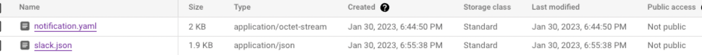
            2.  Cloud Run  
                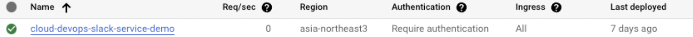

* * *

Result 
-------

*   Cloud Build의 각 상태별 Notification
    *   example
        *   SUCCESS  
            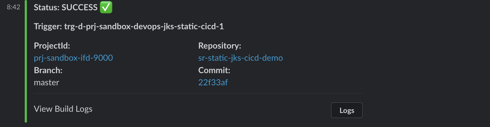
        *   PENDING( Approval 대기 상태 )  
            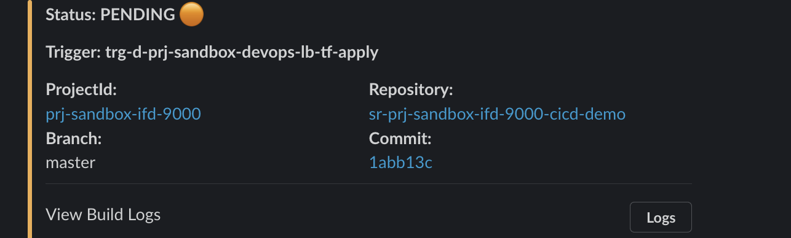  
* * *

Reference
---------

*   [Cloud Build REST API](https://cloud.google.com/build/docs/api/reference/rest/v1/projects.builds)
*   [Cloud Build with Slack Configuration](https://cloud.google.com/build/docs/configuring-notifications/configure-slack?hl=ko)

* * *

**END**